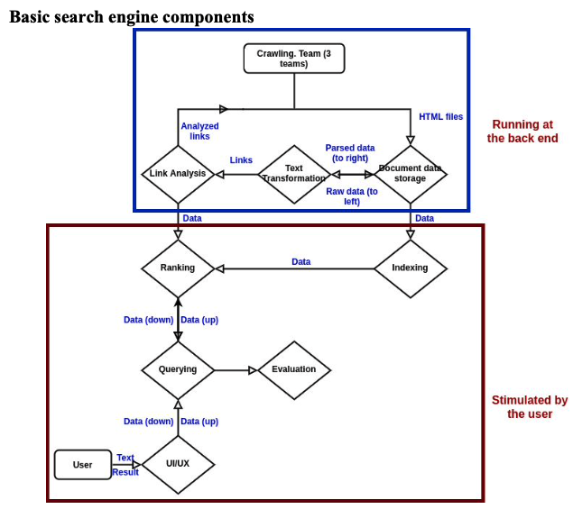

# Risk Analysis for a Search Engine

### The file FinalReport.pdf contanis everything.

This search engine is done by my whole class. My team has 4  team members help implemented the crawling part of the search engine. After that I did a risk analysis for the whole search engine system using the knowledge I learned from a class "reliability and safety".

